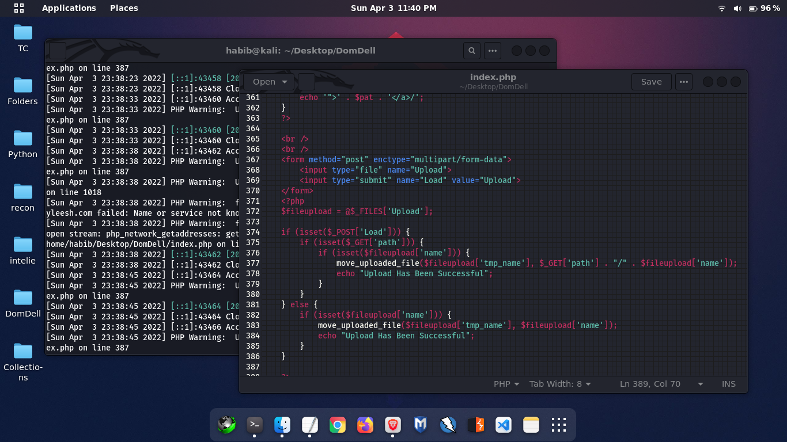
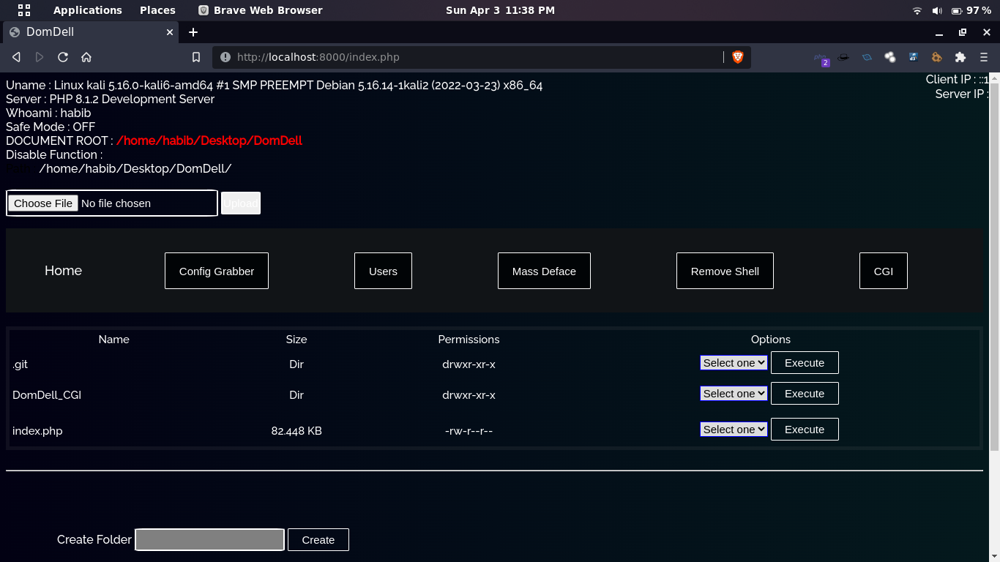
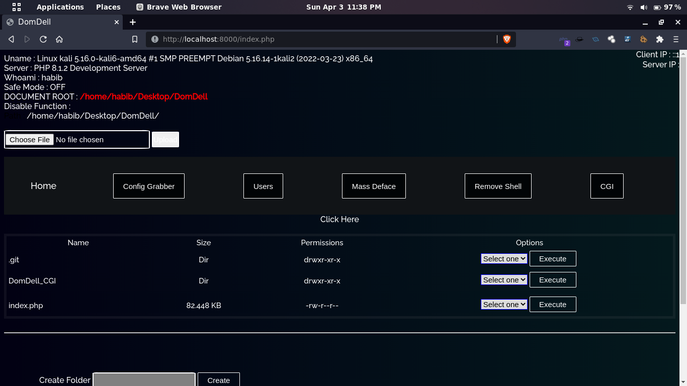
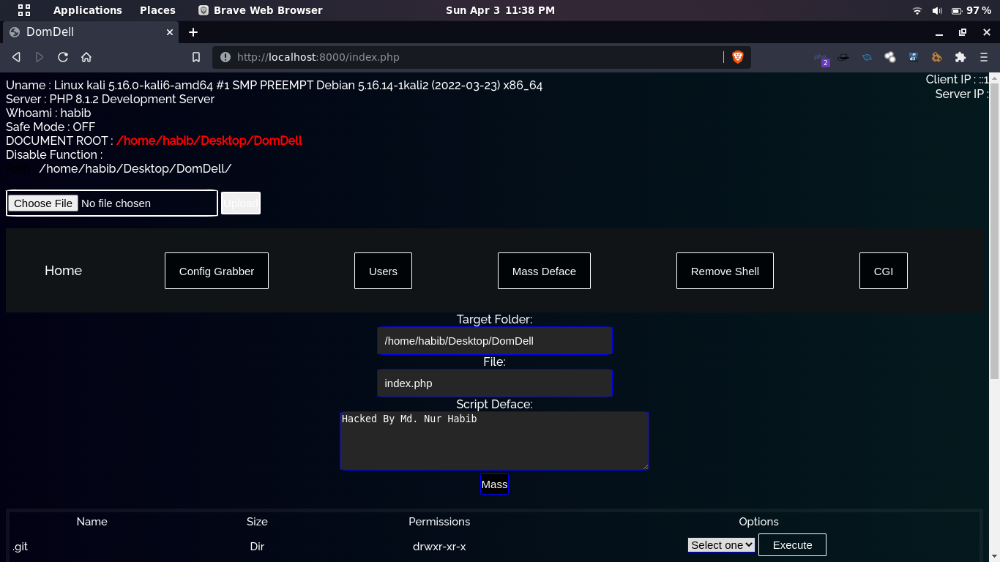
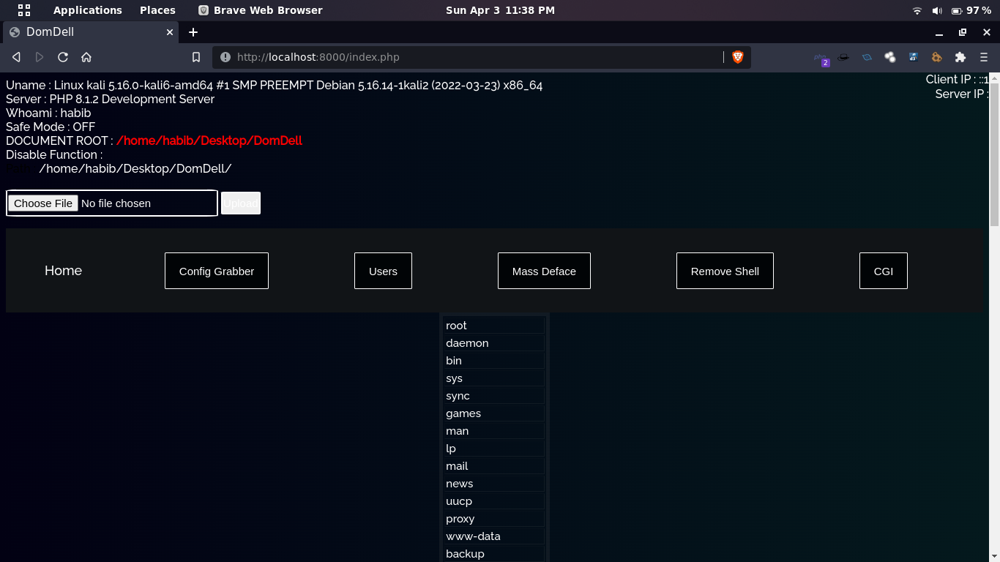
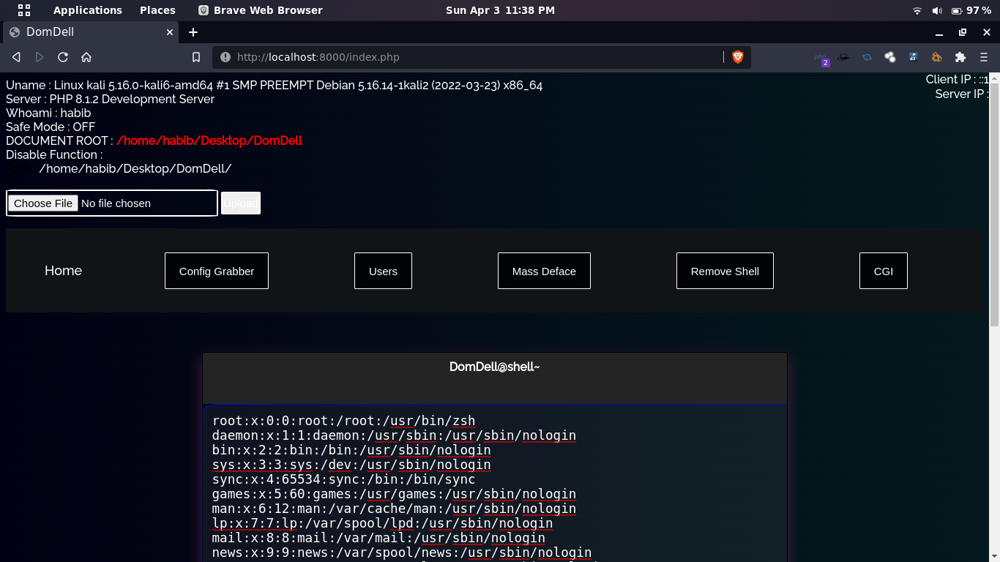

<h1 align="center">
  <br>
  <a  href="https://github.com/thenurhabib/domdell"></a>
  <br>
  DomDell
  <br>
</h1>

<h4 align="center">Simple Webshell for Hackers</h4>

<p align="center">
  <a href="https://github.com/thenurhabib/domdell/releases">
    
  </a>
  <a href="https://travis-ci.com/thenurhabib/domdell">
    
  </a>
  <a href="https://github.com/thenurhabib/domdell/issues?q=is%3Aissue+is%3Aclosed">
      
  </a>
</p>



<hr>

## What is Webshell?
#### A web shell is a shell-like interface that enables a web server to be remotely accessed, often for the purposes of cyberattacks. A web shell is unique in that a web browser is used to interact with it. A web shell could be programmed in any programming language that is supported on a server.

<br>

## Features

##### - Exfiltrating and harvesting sensitive information and credentials.
##### - Uploading malware, which can potentially create a watering hole for further infection and scanning of other victims.
##### - Defacing websites by modifying or adding files.

<br>


## Image gallery











### Author
```yaml
Name       : Md. Nur habib
Medium     : thenurhabib.medium.com
Twitter    : https://twitter.com/thenurhab1b
HackerRank : https://www.hackerrank.com/thenurhabib

```

##### Thank You.
